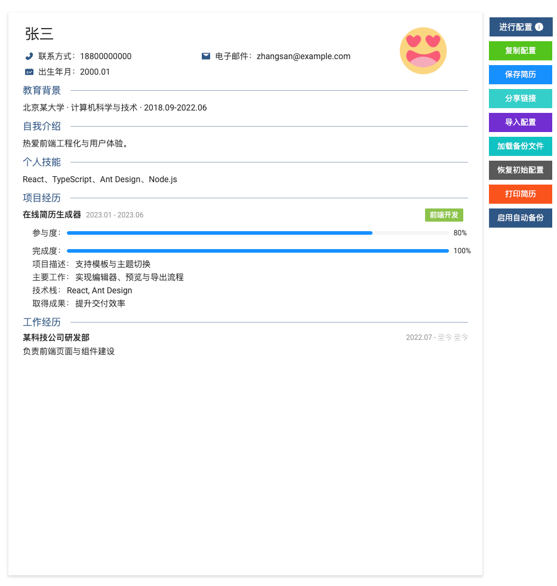

# Resume Generator

本项目基于 https://github.com/visiky/resume 二次开发，感谢大佬的开源代码。

### 背景
在准备考研阶段，比较轻松（~~并不是，压力巨大~~），就想着写写代码，写个简历，之后呢发现了这个宝藏项目，但是呢，一百个人心中有一百个哈姆雷特，因此尝试二次开发加一些自己的需求和功能。

~~主要是内容在全局样式基础上，支持了html标签输入，方便让ai帮我写样式。~~


## 介绍

一个基于 React + Ant Design 的简历生成器，用于在浏览器中编辑简历内容、选择模板与主题，并输出适合 A4 打印的简历页面。

## 目的
- 让简历搭建流程可视化、模块化，减少排版与样式维护成本
- 提供多模板与主题能力，快速生成不同风格的简历
- 支持打印与分享，便于快速交付最终 PDF 或纸质版本
- 头像替换文件 `/public/default.png` 即可



## 安装
- 环境要求：Node.js 16+，推荐使用 Chrome/Edge 浏览器
- 安装依赖：

```bash
npm install
```

- 注意事项：如果报错 cache 可在项目根目录执行： mkdir -p .cache ，再运行 npm run start

## 本地启动

```bash
npm run start
```

启动后访问：
- 查看模式：http://localhost:8000/
- 编辑模式：http://localhost:8000/?mode=edit&template=template1

## 使用
- 编辑模式下可在顶部操作区与右侧配置抽屉中进行内容编辑、模块开关、模板与主题切换
- 打印时会自动隐藏头部与按钮区，保证 A4 版面简洁
- 支持导入/导出配置（JSON），便于迁移与备份

## 构建

```bash
npm run build
```

## 适配与限制
- 移动端仅提供预览，不支持在线编辑
- 自动备份依赖文件系统访问 API
